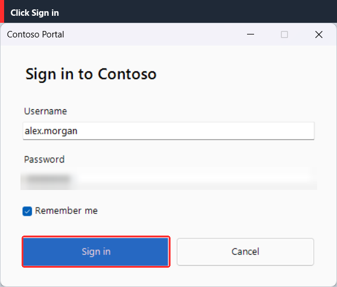

# MakeMyDoc

A small, open-source Windows app that turns what you do on screen into step-by-step documentation.
Press **Start**, work through your task, press **Stop** - MakeMyDoc records every click and the text you type,
screenshots the active window, highlights what you clicked, and lets you clean the result up and export it as
**PDF**, **Markdown** or **HTML**.



**[Landing page]([docs/index.html](https://devisdrago.github.io/MakeMyDoc/))** (published with GitHub Pages) &middot; **[Example exported guide (PDF)](docs/assets/example-guide.pdf)**

## Download

Grab `MakeMyDoc.exe` from the [latest release](../../releases/latest) - no installer and no Python needed. The exe is
not code-signed, so Windows SmartScreen may warn on first run: choose *More info*, then *Run anyway*.
Or run it from source (below).

## Features

- **Records mouse and keyboard globally** - left click, right click, double click, and typed text.
  Consecutive typing between two clicks becomes a single step ("Type: report.txt").
- **Active-window screenshots** (not the whole desktop), multi-monitor and high-DPI aware. Menus and drop-downs
  that stick out of the window are included.
- **Knows what you clicked** via Windows UI Automation: the element's name, type and bounds. The element is
  highlighted; if no bounding box is available a red circle marks the click point.
- **Text bar on every screenshot** ("Left click on: Save") and a **zoomed inset** of the clicked area beside or
  below the screenshot.
- **Sensitive data protection**
  - Password fields (detected through UI Automation) are **blurred before the screenshot is written to disk**.
  - Characters typed into a password field are **never stored** - the step reads "Type: (hidden - password field)".
  - You can blur any other area yourself in the review screen.
- **Review and edit**: thumbnail + editable description per step, reorder, delete, multi-level undo, move/resize
  the auto highlight, draw new highlights/circles/arrows, warning marks, callouts, manual blur, free notes and
  warnings between steps.
- **Label templates**: change "Left click on:" once and every step that you have not hand-edited follows.
- **Export** to PDF, Markdown (GitHub-friendly, images in a `<name>_files` folder) and HTML (single self-contained
  file). Title page and numbered steps; each step is the annotated screenshot only (the description is in its text bar).
- **Sessions**: save a recording as `.json` (screenshots embedded) and re-open/re-export it later.
- **Windows 11 look**: Fluent controls, rounded corners, Segoe Fluent icons and a title bar in the window colour.
  Follows the Windows light/dark setting; change it under Tools > Appearance.
- Minimizes to the **system tray**; a red tray dot and a small always-on-top **REC badge** show when recording
  (the badge is excluded from screenshots on Windows 10 2004+).

## Requirements

- Windows 10 or 11
- Python 3.11+ (only to run from source)

## Install and run from source

```powershell
git clone <your-fork-url> MakeMyDoc
cd MakeMyDoc
python -m venv .venv
.venv\Scripts\activate
pip install -r requirements.txt
python run.py
```

`requirements.txt`: `pynput`, `uiautomation`, `mss`, `Pillow`, `fpdf2`, `pystray` (the system tray icon;
without it the app still works but cannot minimize to the tray) and `sv-ttk` (the Windows 11 look; without it the
app falls back to the plain Windows theme).

## Usage

1. Start MakeMyDoc and press **Start**. The window disappears to the tray and a red **REC** badge appears,
   with **Pause/Resume** and **Stop** buttons next to it (clicks on them are never recorded).
2. Do the task you want to document. Every click and every group of typed text becomes a step.
3. Press **Stop** (or the stop hotkey). The review window opens.
4. Fix descriptions, reorder, delete, add notes/warnings, edit images (click a thumbnail).
5. **Export...** and pick PDF, Markdown and/or HTML.

Clicks on MakeMyDoc's own windows, badge and tray menu are never recorded.

### Hotkeys (while recording)

| Action | Default | Change in |
| --- | --- | --- |
| Pause / resume | `Ctrl+Shift+P` | Tools > Hotkeys... |
| Stop | `Ctrl+Shift+S` | Tools > Hotkeys... |

Hotkey presses are not recorded as steps.

### What ends up in the description

| You did | Step text (default) |
| --- | --- |
| Left click on a control named "Save" | `Left click on: Save` |
| Right click / double click | `Right click on: File` / `Double click on: Notes.txt` |
| Click on something without a name | `Left click at (640, 380)` |
| Typed `hello`, then Tab | `Type: hello[Tab]` |
| Pressed Ctrl+S | `Type: [Ctrl+S]` |
| Typed into a password box | `Type: (hidden - password field)` |

Edit the templates under **Labels...** (review window) or Tools > Label templates.... Placeholders: `{name}`
`{type}` `{x}` `{y}` `{text}`. A description you typed by hand is kept as-is; **Reset text** returns it to the template.

### Review window

| Control | Purpose |
| --- | --- |
| Description box | Edit the step text (commits when you leave the box) |
| Up / Down / Delete | Reorder or remove a step |
| **Insert below** (on a step) | Add a note or warning right after that step |
| **+ Note** / **+ Warning** (top bar) | Pick where to add it ("At the beginning", "After step 3", ...); the dialog stays open so you can add several |
| Thumbnail / **Edit image...** | Open the image editor |
| Zoom inset | Show/hide the magnified detail |
| Undo (`Ctrl+Z`) | Undo the last delete, reorder or edit (many levels) |

**Image editor tools**: Select/move (drag a shape, drag square handles to resize), Highlight, Circle, Arrow,
**Blur**, **Warning** (amber zone + icon + note), **Callout** (note box), **Crop** (drag the area to keep;
drag its border or handles to adjust; **Reset crop** brings the full screenshot back). `Delete` removes the
selected shape. A crop is reversible and applies to one step; the zoom inset is cut from the cropped picture too.
Blur, crop and annotations are applied when exporting, so you can still change them - except password-field
blur, which is baked into the stored screenshot on purpose. Saved sessions keep the full, uncropped screenshot.

### Sessions and temp files

Screenshots are stored in `%TEMP%\MakeMyDoc\session_*`. **File > Save session...** writes a single `.json`
containing the steps and the screenshots, so you can re-open and re-export later (File > Open session...).
**File > Clean up temporary files...** deletes the current and any leftover session folders on demand.
Settings live in `%APPDATA%\MakeMyDoc\config.json`; a log is written to `%APPDATA%\MakeMyDoc\makemydoc.log`.

> Session files contain your screenshots. Password fields are already blurred in them, but areas you did not
> blur are stored as captured - treat the file like the screenshots themselves.

## Administrator (elevated) apps

Windows does not let a normal process see mouse/keyboard events or UI Automation data of an app running as
administrator. MakeMyDoc detects this while recording and shows a warning on the badge, the tray and the
control window. To record such an app use **Tools > Restart as administrator...** (or start MakeMyDoc elevated).

When active-window capture or element metadata is unavailable for other reasons, MakeMyDoc degrades instead of
failing: it captures the whole monitor under the cursor and describes the click by its coordinates
("Left click at (x, y)") with a red circle.

## Build a single `.exe`

```powershell
pip install -r requirements-dev.txt
pyinstaller MakeMyDoc.spec
```

The result is `dist\MakeMyDoc.exe` (windowed, one file). The spec collects `uiautomation` and `comtypes` and the
`pynput`/`pystray` Windows backends. If element names are missing in the built exe but work from source, the
UI Automation wrappers were not bundled - re-run PyInstaller after a first successful run from source so
`comtypes` has generated them.

Quick manual build without the spec:

```powershell
pyinstaller --onefile --windowed --name MakeMyDoc --collect-all uiautomation --collect-all comtypes ^
  --hidden-import pynput.keyboard._win32 --hidden-import pynput.mouse._win32 --hidden-import pystray._win32 run.py
```

## Publishing (maintainers)

- **Landing page:** `docs/index.html`. In the GitHub repo choose *Settings > Pages > Build and deployment >
  Deploy from a branch > `main` / `docs`*. The page finds the repo links by itself.
- **CI:** `.github/workflows/ci.yml` runs the tests on every push and pull request.
- **Releases:** push a tag (`git tag v1.0.0 && git push origin v1.0.0`) and `.github/workflows/release.yml` builds
  `MakeMyDoc.exe` and attaches it to a GitHub release.

## Project layout

```
run.py                  launcher (PyInstaller entry point)
makemydoc/
  main.py               control window, app wiring
  capture.py            global hooks, active-window screenshots, UI Automation, password handling
  annotate.py           highlight, blur, zoom inset, text bar, callouts
  review.py             review/edit window, image editor, label/hotkey/export dialogs
  export.py             PDF, Markdown, HTML
  config.py             label templates, hotkeys, settings
  session.py            steps/annotations model, undo, session .json
  tray.py               tray icon, REC badge, UI thread bridge
  winutil.py            Win32 helpers (windows, DPI, elevation)
docs/                   landing page (GitHub Pages) and its screenshots
.github/workflows/      CI and release automation
tools/make_icon.py       regenerates assets/MakeMyDoc.ico
assets/MakeMyDoc.ico    app icon (exe + windows)
tests/test_core.py      headless tests (pytest)
```

## Tests

```powershell
pip install -r requirements-dev.txt
pytest
```

## Limitations

- Windows only. Developed and tested on Windows 11 with a single display: Windows 10 and multi-monitor setups are
  implemented but not tested yet.
- Password detection relies on UI Automation exposing the field (`IsPassword`). Custom-drawn password boxes
  and some games do not expose it - blur those manually in the review screen.
- Screenshots are a crop of the screen at the window's position, so anything overlapping the window at click
  time (another window, a tooltip) appears in the picture.
- Middle-button clicks, scrolling and mouse drags are not recorded.

## License

MIT - see [LICENSE](LICENSE).
